# Tattoo Lounge
Website developed for marketing end publishing a tattoo lounge.

Link for the page: https://tattooarialoungeink.000webhostapp.com/

Build with

>PHP was server side programming language
>
>MysQL was database management system
>
>HTML for structure the page
>
>CSS as stylesheet
>
>Bootstrap only for the slideshow

# The Start Page
Here you have information about the services provided, the environment, lounge and contact links.

The navigation bar take you to gallery page and for the contact links.
The whatsapp button is directly linked with the lounge number.

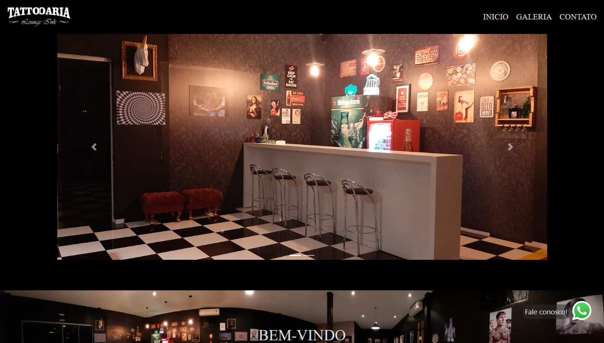
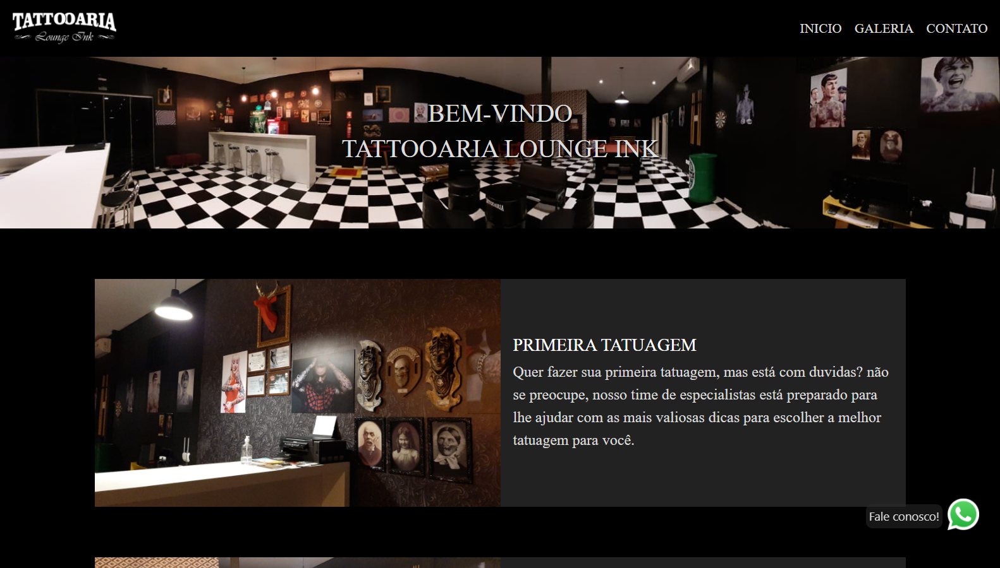
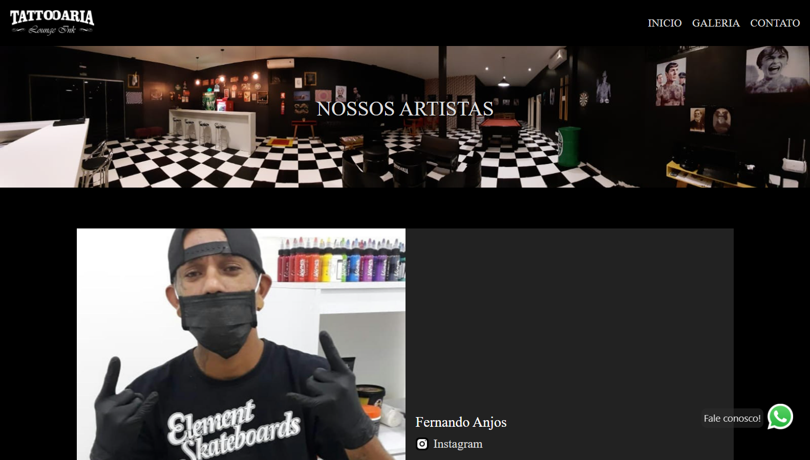
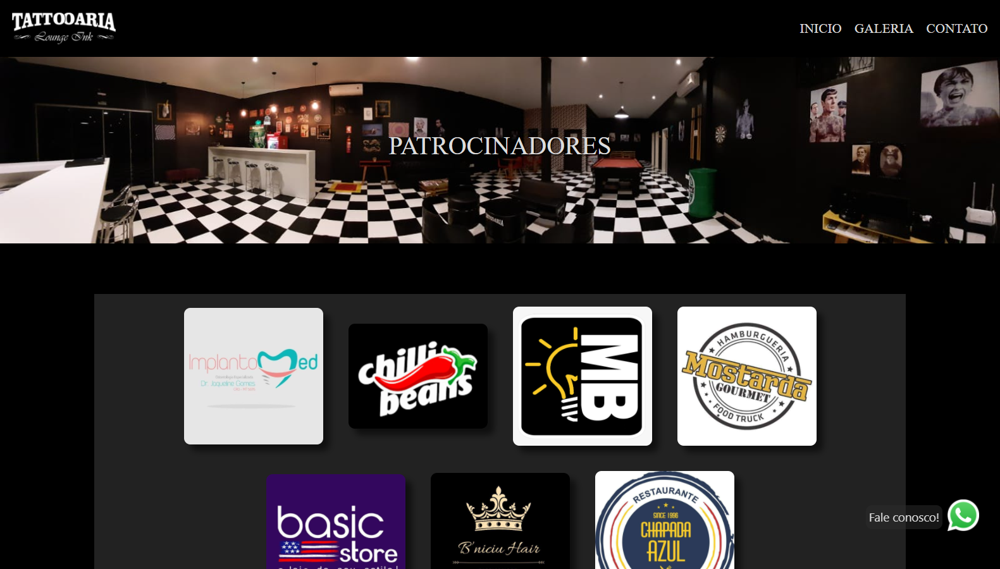

# Photo Gallery
This page show photos of the latest work done in the tattoo studio.

With filter by tags and pagination.

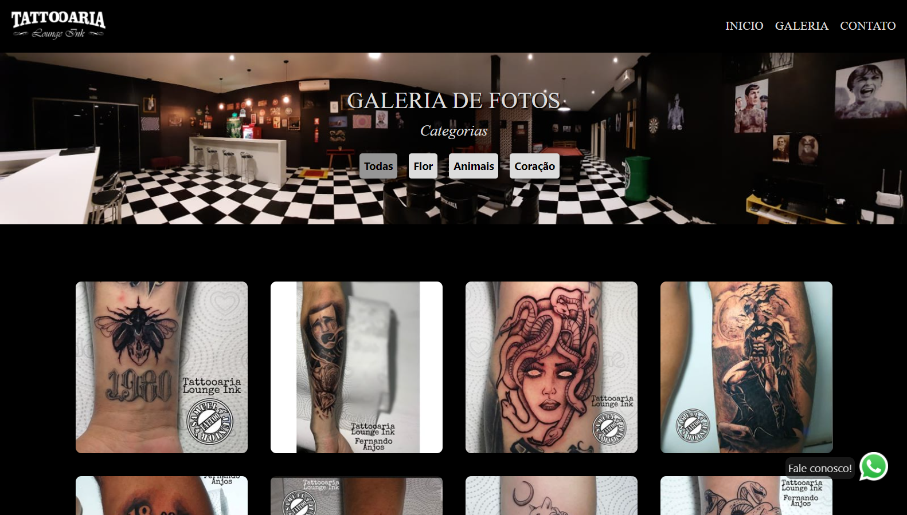
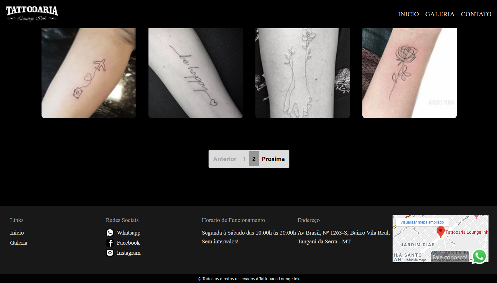

# Control Panel
Thats a webpage admin system build for this web site.

I made a CRUD for each section on the website where contains information.
The user can modify any text and picture of the website.
The control panel have a authentication page, only user with authorized login and password can access.

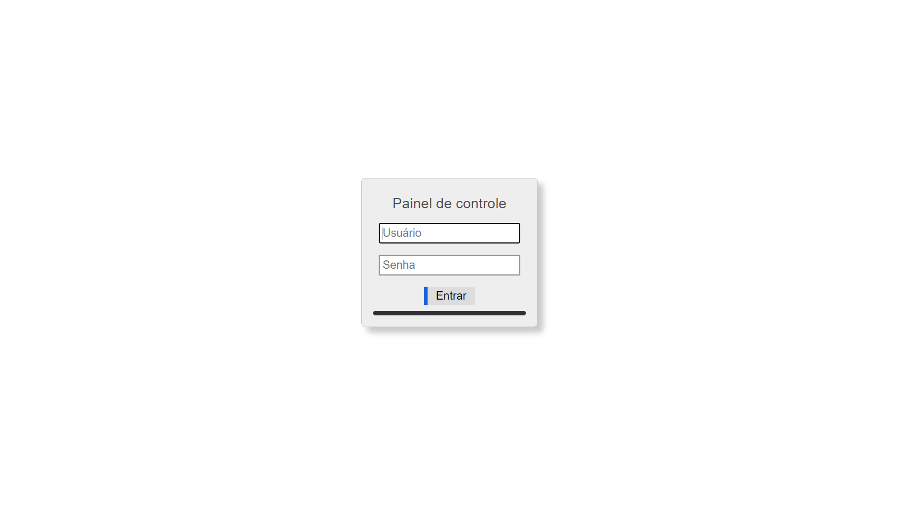
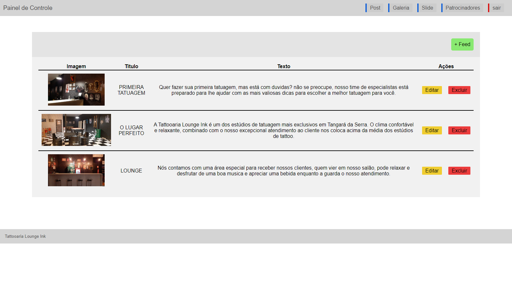
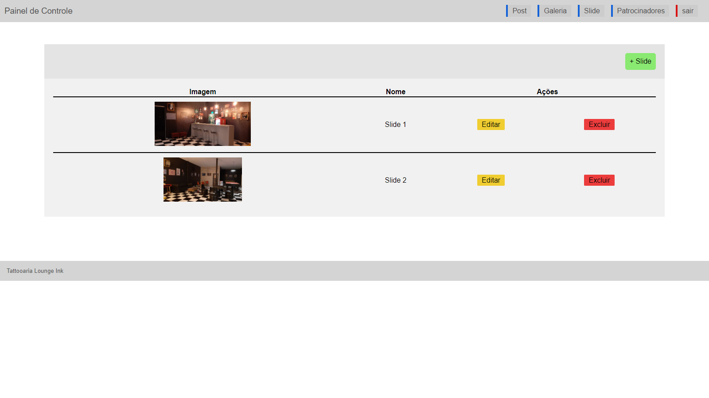
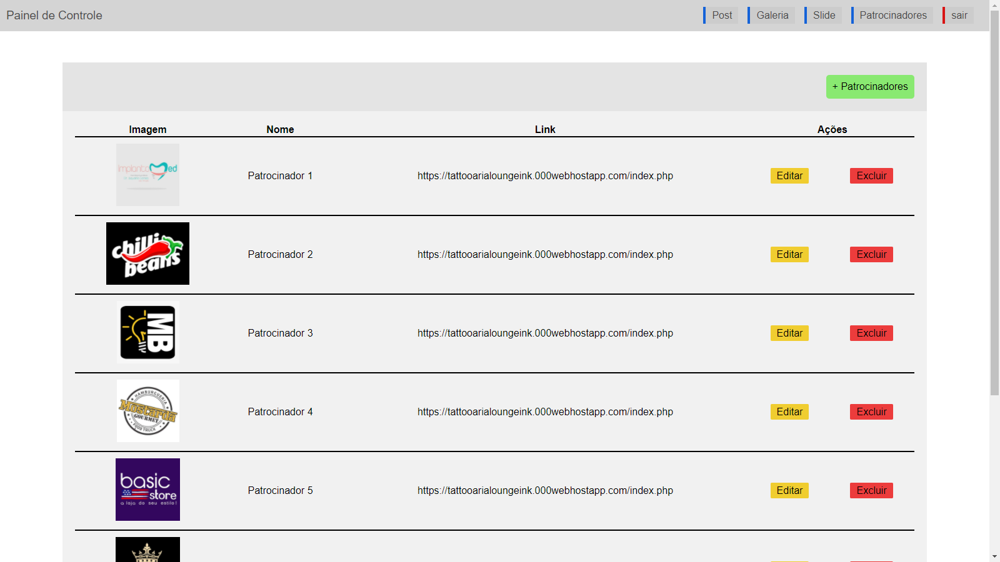
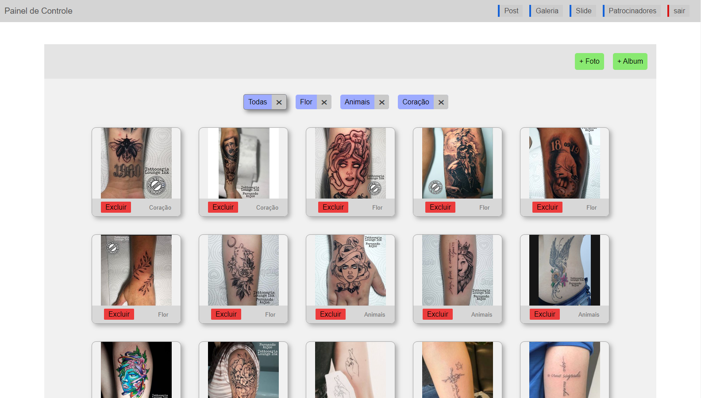
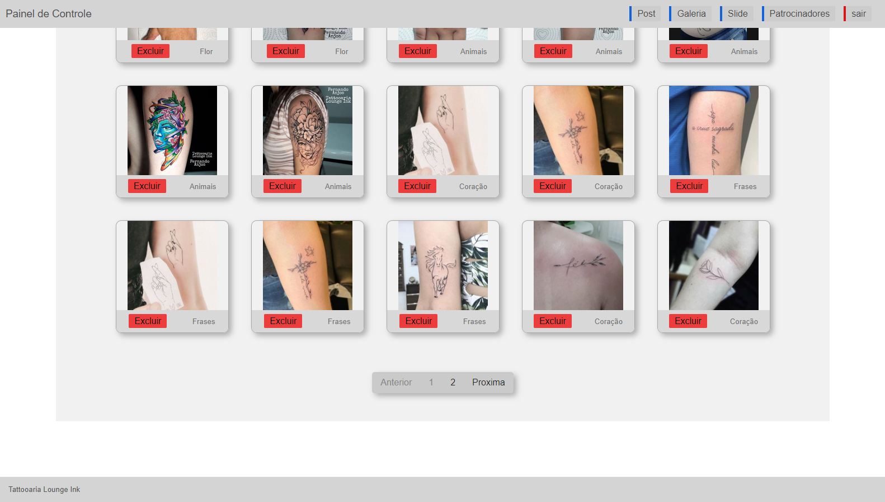

Modals to create, update and delete

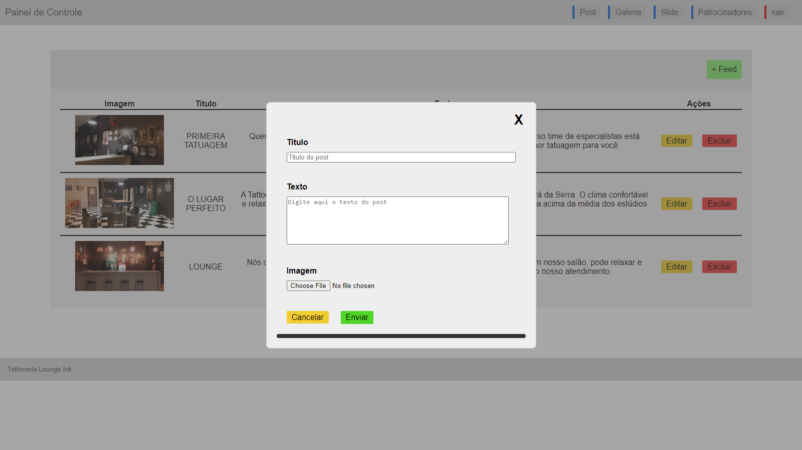
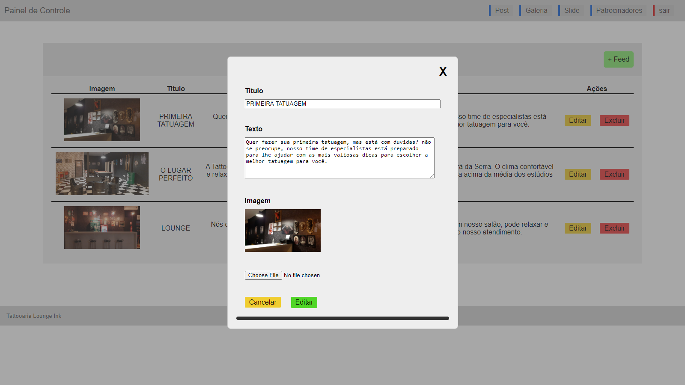
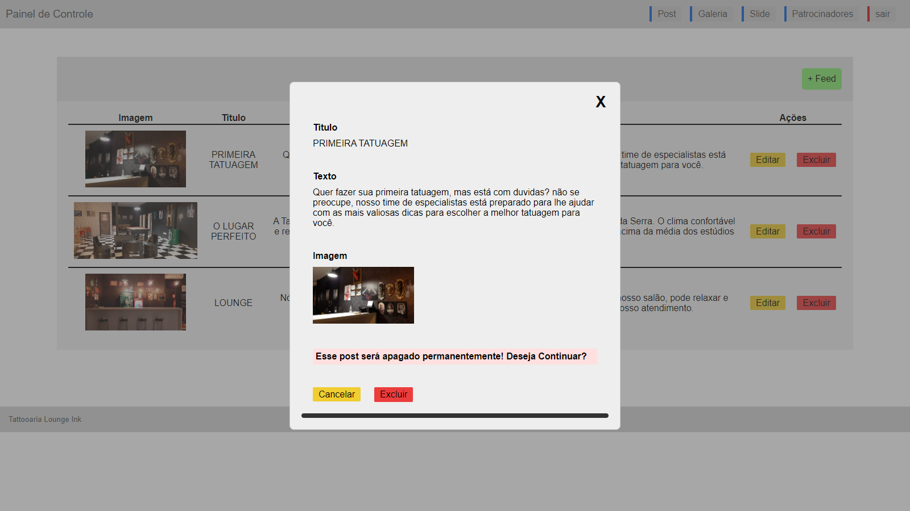

*This was my first website and system development project, i appreciate any suggestion or feedback.*

*Thank you to read!* ❤️
